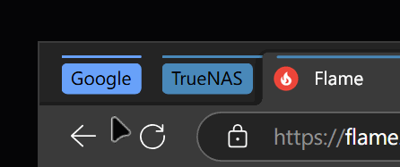

# TabGroup Keyboard Shortcuts

A browser extension that adds keyboard shortcuts for managing tab groups in Edge. When a keyboard shortcut is pressed, it performs actions on the tab group currently being hovered by the cursor.



## Features

- `Alt+Shift+W`: Close all tabs in the hovered group
- `Alt+Shift+Q`: Close all groups except the hovered group

These keyboards shortcuts are configurable in `edge://extensions/shortcuts`

## Requirements

- Rust
- GNU Make for Windows
- Node.js (only for testing)

## Installation

1. Clone the repository:
   ```bash
   git clone <repository-url>
   cd <repository-name>
   ```

2. Build and install the native components:
   ```bash
   make install
   ```

3. Load the extension in Chrome/Edge:
   - Open `edge://extensions`
   - Enable "Developer mode"
   - Click "Load unpacked"
   - Select the repository directory
  
   It is normal to see errors now as the extension id can be different depending on where the project is cloned.

4. Set the correct extension id:
   - Find the extension id generated for it
   - Replace the extension id in `native-messaging-host.json` with the one you obtained 
   - Click "Reload"

## Project Structure

- `native-host/`: Native messaging host
  - Handles communication between browser and hover detector
  - Manages message protocol with extension

- `hover-detector/`: Tab group hover detection
  - Detects which tab group is being hovered
  - Returns 1-based index of the hovered group in the active Edge window from left to right

- `background.js`: Extension background script
  - Listens for keyboard shortcuts
  - Communicates with native host
  - Manages tab group operations

- `ahk-script/`: (Optional) AHK script for mapping middle button click over a tab group to a keyboard shortcut

## Notes

This extension relies on specific, observed behaviors of the browser that may change in future updates. This makes it potentially fragile. Key heuristics used, particularly for hover detection, are:

1. **Locating Title Bar:** The program assumse that the top `VERTICAL_THRESHOLD` pixels of the window belongs to title bar. It might require adjustment based on your scaling factor or other specific UI configurations. By seting environment variable `TABGROUP_HOVER_DETECTOR_VERBOSE`, the program will save logs and screenshots of the tab bar to disk for debugging.

2. **Identifying the Active Edge Window:** When hovering over a collapsed tab group, Edge displays a pop-up window listing the tabs within that group. This action causes the main browser window to lose focus. The extension finds the main browser window by searching for Edge windows whose top border is within `y_threshold` pixels above the pop-up and selects the window closest to the pop-up horizontally.

3. **Locating Tab Groups:** Edge currently supports only 9 predefined colors for tab groups. The extension leverages this to determine the starting and ending point of tab groups by scanning for color transitions between the tab bar's background color and one of these 9 colors along the center line of the tab bar. The `BACKGROUND_COLOR` might need to be modified to match your chosen theme. The extension can fail if the background of the tab bar cis not uniform and contains a color reserved for tab groups.
