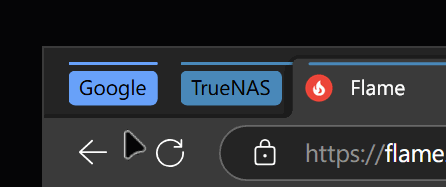

# TabGroup Keyboard Shortcuts

A browser extension that adds keyboard shortcuts for managing tab groups in Edge. When a keyboard shortcut is pressed, it performs actions on the tab group currently being hovered by the cursor.



## Features

- `Alt+Shift+W`: Close all tabs in the hovered group
- `Alt+Shift+Q`: Close all groups except the hovered group

These keyboards shortcuts are configurable in `edge://extensions/shortcuts`

## Requirements

- Rust
- GNU Make for Windows
- Node.js (only for testing)

## Installation

1. Clone the repository:
   ```bash
   git clone <repository-url>
   cd <repository-name>
   ```

2. Build and install the native components:
   ```bash
   make install
   ```

3. Load the extension in Chrome/Edge:
   - Open `edge://extensions`
   - Enable "Developer mode"
   - Click "Load unpacked"
   - Select the repository directory
  
   It is normal to see errors now as the extension id can be different depending on where the project is cloned.

4. Set the correct extension id:
   - Find the extension id generated for it
   - Replace the extension id in `native-messaging-host.json` with the one you obtained 
   - Click "Reload"

## Project Structure

- `native-host/`: Native messaging host
  - Handles communication between browser and hover detector
  - Manages message protocol with extension

- `hover-detector/`: Tab group hover detection
  - Detects which tab group is being hovered
  - Returns 1-based index of the hovered group in the active Edge window from left to right

- `background.js`: Extension background script
  - Listens for keyboard shortcuts
  - Communicates with native host
  - Manages tab group operations

- `ahk-script/`: (Optional) AHK script for mapping middle button click over a tab group to a keyboard shortcut

## Notes

This extension relies on specific, observed behaviors of the browser that may change in future updates. This makes it potentially fragile. Key heuristics used, particularly for hover detection, are:

1. **Locating Title Bar:** The program assumse that the top `VERTICAL_THRESHOLD` pixels of the window belongs to title bar. It might require adjustment based on your scaling factor or other specific UI configurations. By seting environment variable `TABGROUP_HOVER_DETECTOR_VERBOSE`, the program will save logs and screenshots of the tab bar to disk for debugging.

2. **Identifying the Active Edge Window:** When hovering over a collapsed tab group, Edge may focus a pop-up/flyout window with an empty title. The detector resolves the real browser window using Win32 window handles (`WindowFromPoint`, foreground window, owner/root-owner chain), then falls back to the browser window under the cursor.

3. **Locating Tab Groups:** The detector matches known tab-group colors with a tolerance and learns background colors from each captured scanline, instead of relying on one exact background RGB value. This is more robust across Edge updates, themes, and rendering differences.

4. **Optional Color Overrides:** You can override color detection at runtime without rebuilding:
   - `TABGROUP_HOVER_EXTRA_COLORS`: Comma/space separated hex colors (for example `#5E87BC,#DB6ABA`)
   - `TABGROUP_HOVER_BG_COLORS`: Comma/space separated hex background colors (for example `#000000,#333333`)
   - `TABGROUP_HOVER_MIN_GROUP_WIDTH`: Minimum width (pixels) for an accepted tab-group segment (default `24`)
   - `TABGROUP_HOVER_MIN_BG_GAP_WIDTH`: Minimum continuous background gap (pixels) required to split groups (default `8`)
