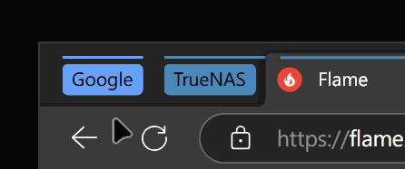

# TabGroup Keyboard Shortcuts

A Windows-only Microsoft Edge extension that lets you act on the tab group currently under the cursor. Hover detection depends on a separately installed native companion.



## Features

- `Alt+Shift+W`: Close all tabs in the hovered group
- `Alt+Shift+Q`: Close all groups except the hovered group

These keyboard shortcuts are configurable in `edge://extensions/shortcuts`.

## Platform Support

- Microsoft Edge on Windows
- Native companion install required for hover detection
- Optional AutoHotkey helper for middle-click ergonomics

## Windows Setup

Follow the dedicated Windows setup guide:

- [docs/WINDOWS_SETUP.md](docs/WINDOWS_SETUP.md)

For local development, the typical flow is:

```powershell
cargo build --release --manifest-path native-host/Cargo.toml
cargo build --release --manifest-path hover-detector/Cargo.toml
.\install.ps1 -Channel development
```

Then load the repo as an unpacked extension in `edge://extensions` and reload it after the install script finishes.

## Store Packaging

Build the Edge Add-ons submission zip with:

```powershell
.\scripts\package-edge-store.ps1
```

Reviewer/store copy lives in [docs/EDGE_STORE_SUBMISSION.md](docs/EDGE_STORE_SUBMISSION.md).

Package the Windows companion bundle with:

```powershell
.\scripts\package-windows-companion.ps1
```

That bundle is the intended Windows release artifact for users who should be able to extract it and run `install.ps1` directly.

## Attribution

The extension icon is generated from a combined Flaticon-based image and requires attribution:

- [docs/ATTRIBUTION.md](docs/ATTRIBUTION.md)

## Project Structure

- `native-host/`: Native messaging host
  - Handles communication between browser and hover detector
  - Manages message protocol with extension

- `hover-detector/`: Tab group hover detection
  - Detects which tab group is being hovered
  - Returns 1-based index of the hovered group in the active Edge window from left to right

- `background.js`: Extension background script
  - Listens for keyboard shortcuts
  - Sends one-shot requests to the native host
  - Manages tab group operations

- `ahk-script/`: Optional AutoHotkey helper for mapping middle click over a tab group to a keyboard shortcut

## Notes

This extension relies on specific, observed behaviors of the browser that may change in future updates. This makes it potentially fragile. Key heuristics used, particularly for hover detection, are:

1. **Locating Title Bar:** The detector assumes that the top `VERTICAL_THRESHOLD` pixels of the window belong to the title bar. It might require adjustment based on scaling factor or other UI-specific configurations. Setting `TABGROUP_HOVER_DETECTOR_VERBOSE=1` writes logs and screenshots to `%LOCALAPPDATA%\TabGroupShortcut\`.

2. **Identifying the Active Edge Window:** When hovering over a collapsed tab group, Edge may focus a pop-up/flyout window with an empty title. The detector resolves the real browser window using Win32 window handles (`WindowFromPoint`, foreground window, owner/root-owner chain), then falls back to the browser window under the cursor.

3. **Locating Tab Groups:** The detector matches known tab-group colors with a tolerance and learns background colors from each captured scanline, instead of relying on one exact background RGB value. This is more robust across Edge updates, themes, and rendering differences.

4. **Optional Color Overrides:** You can override color detection at runtime without rebuilding:
   - `TABGROUP_HOVER_EXTRA_COLORS`: Comma/space separated hex colors (for example `#5E87BC,#DB6ABA`)
   - `TABGROUP_HOVER_BG_COLORS`: Comma/space separated hex background colors (for example `#000000,#333333`)
   - `TABGROUP_HOVER_MIN_GROUP_WIDTH`: Minimum width (pixels) for an accepted tab-group segment (default `24`)
   - `TABGROUP_HOVER_MIN_BG_GAP_WIDTH`: Minimum continuous background gap (pixels) required to split groups (default `8`)
